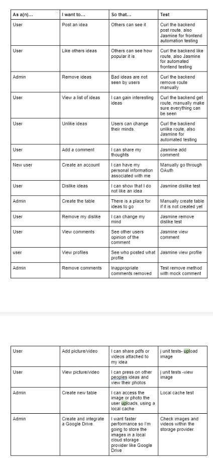
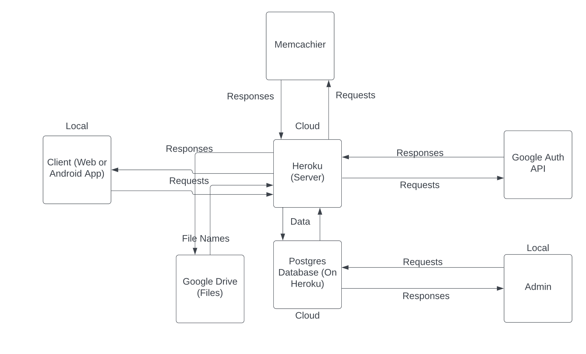
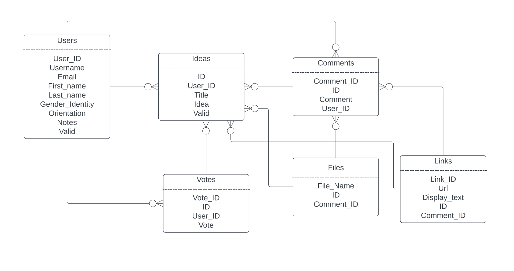
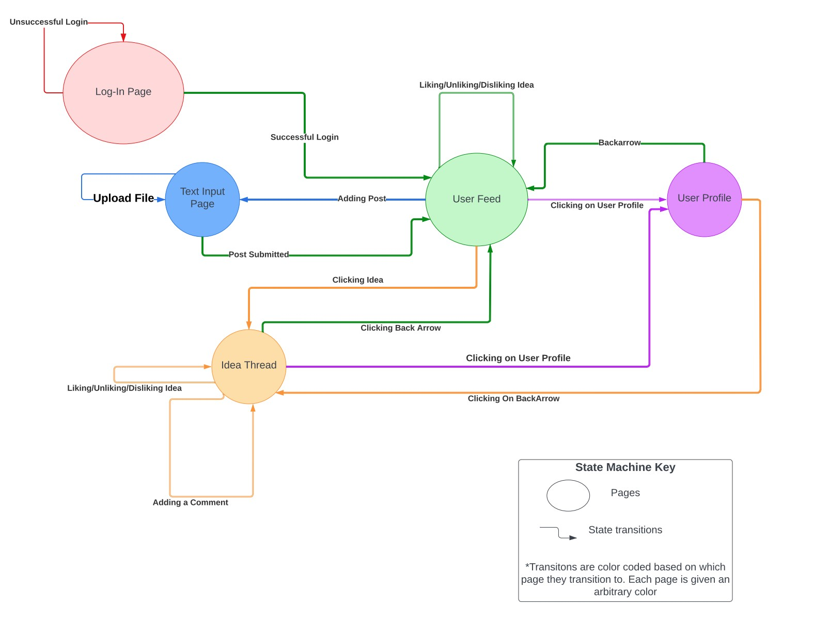
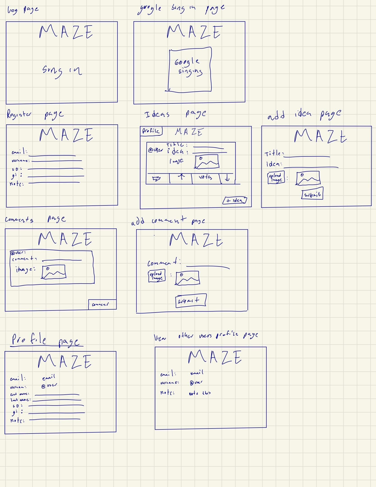
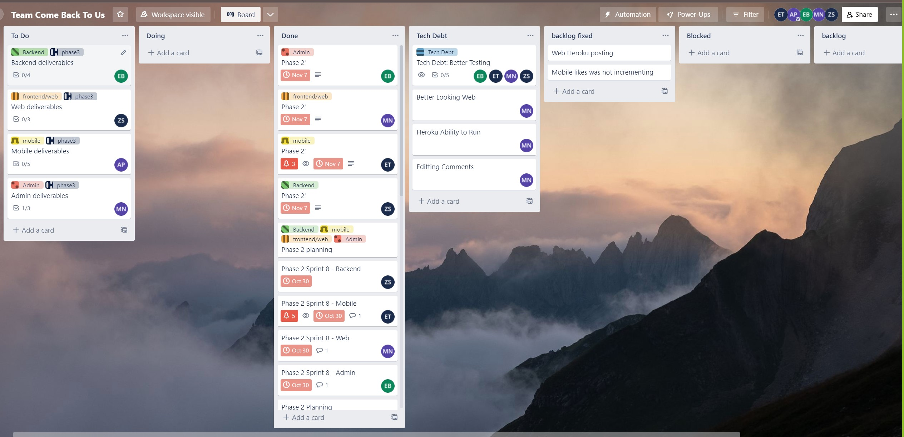

# Team ComeBackToUs

Project Name : MAZE
Description : Web and Mobile interfaces of a program that allows a user to add, like , dislike and delete an idea
Members: Michael Ngoga(smn224@lehigh.edu)
Amelie Pankov(amp524@lehigh.edu)
Eli Brennan(ebb224@lehigh.edu)
Zach Silberstein(zjs224@lehigh.edu)
Erick Tepan(ert224@lehigh.edu) 

Repository <https://bitbucket.org/zachsilberstein/cse216_comebacktous/src/master/>

Trello <https://trello.com/b/Dbk17eET/team-come-back-to-us>

Heroku <https://dashboard.heroku.com/apps/dry-wave-47246>

Project name : MAZE
Members : Michael Ngoga(smn224@lehigh.edu)
Zach Silberstein(zjs224@lehigh.edu)
Amelie Pankov (amp524@lehigh.edu)
Erick Tepan(ert234@lehigh.edu)
Eli Brenan(ebb224@lehigh.edu)

Description of Tagged release: The tagged release composed of a web and mobile interface that allow you to add an idea, like it, dellete it and unlike aswell.
It also counts the number of likes on each idea. The two interfaces are almost alike.

Test Instrcutions: - From the web folder run sh deploy.sh - From the backend run mvn package , then mvn heroku:deploy http://dry-wave-47246.herokuapp.com/index.html

### User Stories and Individual Tests

### System Diagram

### ER-Diagram

### Drawing of the State Machine for the Anonymous User Persona's Interaction with the Application

### Mock

### Trello Board

### Routes:
* POST /postidea - takes a title and idea (strings), and userid (int) and adds a new idea to the Idea table
* PUT /likes/:id/:inc_dec/:userid/:up_down - updates the likes/dislikes (based on up_down), either increments or decrements based on inc_dec
* GET /ideas - gets a list of all the ideas for the user
* GET /ideas/idea/:id - gets a single idea 
* DELETE /ideas/:id - takes an idea id (int) and deletes it from the DB
* POST /comment/ - comment on someone's idea, takes id, comment, userid
* GET /comments/:id - gets all the comments for that idea based on id
* GET /user/:id - get a user by their id
* GET /users/ - get all users 
* POST /login - does OAuth login
* POST /profile/:id - updates user's profile with given GI, SO, note
* PUT /addfile -add file to idea or comment

### TESTS

Backend - use curl and write tests checking the DB functions

Admin - Testing functions for adding and getting from DB

Web - User uses website manually and clicks on all the options to make sure there is a result for each option.

Mobile Test - User uses mobile manually and clicks on all the options to make sure there is a result for each option.
